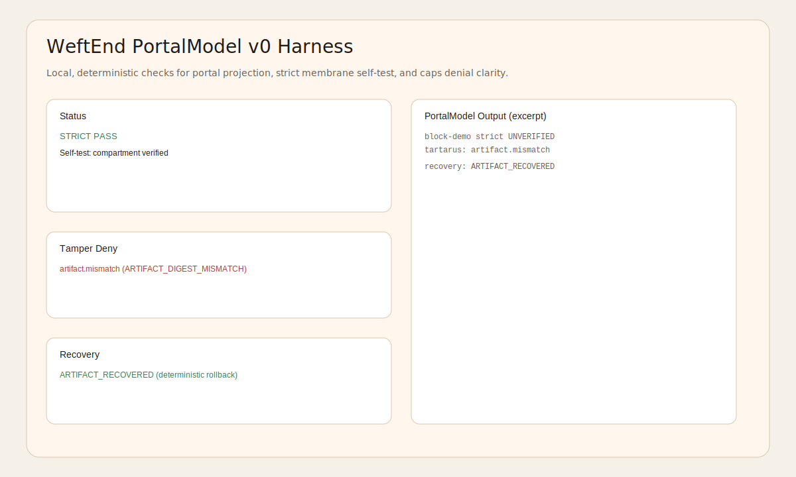

# DEMO_GOLDEN_PATH.md - WeftEnd Harness Golden Path (v0)

This is the exact demo sequence used to verify the local harness end-to-end.

## Golden Path (verbatim)

1) In `C:\Users\dibla\Documents\GitHub\WeftEnd`:
`npm test`

2) Enable demo crypto for CLI/devkit publish flows:
`$env:WEFTEND_ALLOW_DEMO_CRYPTO="1"`

3) Start the harness server:
`npm run serve`

4) Open this file in the browser via the server:
`http://localhost:5173/test/harness/portal.html`

5) Run the strict loader in Node:
`node examples/hello-mod/run_strict_load.js --scenario=ok`



Optional: Path digest binding in release publish

Add `pathDigest` to `publish.json`, or pass it on the CLI (must match if both are set):
`node dist/src/cli/main.js publish out/publish_in out/publish_out --path-digest fnv1a32:deadbeef`

## What this proves

- Strict mode self-test passes and is surfaced as a first-class truth.
- Tamper detection produces deterministic denies (`artifact.mismatch`) with no silent repair.
- Deterministic recovery is explicit (`ARTIFACT_RECOVERED`) and never claimed as "clean".

---

## 30-Second Checklist

- Status shows `Strict PASS` and `compartment verified`
- Secret Zone availability shows `ready: http://localhost:5173/src/runtime/secretzone/secret_zone.html`
- Release manifest status is `ok`
- Evidence digest tamper shows `EVIDENCE_DIGEST_MISMATCH`
- Release manifest tamper shows `RELEASE_SIGNATURE_BAD`
- Tartarus summary present is `ok`
- Artifact tamper (no recovery) shows `ARTIFACT_DIGEST_MISMATCH`
- Artifact tamper (recovered) shows `ARTIFACT_RECOVERED`
- DevKit Publish returns `OK - releaseId: ...`
- Node strict load (ok) prints `verdict: "ALLOW"` with empty `reasonCodes`
- If provided, the release line shows `path=<digest>` for the bound path summary.

---

## Market Story (Import -> Admit -> Promote -> Mirror -> Strict Load)

1) Build the CLI:
`npm run compile --silent`

2) Create a minimal mod:
```
mkdir out\demo_mod
@'
exports.main = async () => ({ ok: true });
'@ | Set-Content out\demo_mod\main.js
```

3) Import (safe policy):
`node dist/src/cli/main.js import out/demo_mod out/demo_import --policy safe --entry main.js`

4) Publish seed snapshots:
`node dist/src/cli/main.js market publish out/markets/t1 --tier T1 --policy policy-demo --blocks seed-t1`
`node dist/src/cli/main.js market publish out/markets/t2 --tier T2 --policy policy-demo --blocks seed-t2`
`node dist/src/cli/main.js market publish out/markets/t3 --tier T3 --policy policy-demo --blocks seed-t3`

5) Admit to T1:
`node dist/src/cli/main.js market admit out/markets/t1 out/demo_import`

6) Add signature evidence (for T2/T3 promotion):
```
node -e 'const fs=require("fs"); const { canonicalJSON }=require("./dist/src/core/canon"); const { computeEvidenceIdV0 }=require("./dist/src/core/validate"); const evidencePath="out/demo_import/weftend/evidence.json"; const manifestPath="out/demo_import/weftend/manifest.json"; const reportPath="out/demo_import/weftend/import_report.json"; const evidence=JSON.parse(fs.readFileSync(evidencePath,"utf8")); const record={ kind:"signature.v1", payload:{ sig:"demo" }, issuer:"demo" }; record.evidenceId=computeEvidenceIdV0(record); evidence.records=[...evidence.records, record].sort((a,b)=> (a.evidenceId < b.evidenceId ? -1 : a.evidenceId > b.evidenceId ? 1 : 0)); fs.writeFileSync(evidencePath, canonicalJSON(evidence)+"\n"); const manifest=JSON.parse(fs.readFileSync(manifestPath,"utf8")); manifest.manifestBody.evidenceDigests=Array.from(new Set([...(manifest.manifestBody.evidenceDigests||[]), record.evidenceId])).sort(); fs.writeFileSync(manifestPath, canonicalJSON(manifest)+"\n"); const report=JSON.parse(fs.readFileSync(reportPath,"utf8")); report.evidenceDigests=Array.from(new Set([...(report.evidenceDigests||[]), record.evidenceId])).sort(); fs.writeFileSync(reportPath, canonicalJSON(report)+"\n");'
```

7) Promote to T2 and T3:
`node dist/src/cli/main.js market admit out/markets/t2 out/demo_import`
`node dist/src/cli/main.js market admit out/markets/t3 out/demo_import`

8) Mirror down (one-way valve):
`node dist/src/cli/main.js market mirror out/markets/t3 out/markets/t2`
`node dist/src/cli/main.js market mirror out/markets/t2 out/markets/t1`

9) Resolve and pin the snapshot:
`node dist/src/cli/main.js market resolve out/markets/t1 <blockHash>`
Use `<blockHash>` from `out/demo_import/weftend/import_report.json` and record the `snapshotDigest` as the pinned market snapshot.

10) Strict load using the pinned block:
```
node -e 'const fs=require("fs"); const path=require("path"); const { devkitLoadStrict }=require("./dist/src/devkit/strict_loader"); const { ArtifactStoreV0, computeArtifactDigestV0 }=require("./dist/src/runtime/store/artifact_store"); const { makeReleaseManifest, makeReleaseCryptoPort, releaseKeyAllowlist }=require("./dist/src/runtime/test_support/release_manifest"); const report=JSON.parse(fs.readFileSync("out/demo_import/weftend/import_report.json","utf8")); const entry=report.entryPath || "main.js"; const sourceText=fs.readFileSync(path.join("out/demo_import/payload", entry),"utf8"); const planDigest=report.planDigest; const policyDigest=report.policyDigest; const blockHash=report.blockHash; const expectedSourceDigest=computeArtifactDigestV0(sourceText); const store=new ArtifactStoreV0({ planDigest, blockHash }); store.put(expectedSourceDigest, sourceText); const releaseManifest=makeReleaseManifest(planDigest, [blockHash], policyDigest); const workerScript=path.resolve("dist/src/runtime/strict/sandbox_bootstrap.js"); devkitLoadStrict({ workerScript, planDigest, policyDigest, callerBlockHash:blockHash, sourceText, entryExportName:"main", expectedSourceDigest, artifactStore:store, grantedCaps: report.policyDecision?.eligibleCaps || [], releaseManifest, releaseKeyAllowlist, cryptoPort: makeReleaseCryptoPort() }).then((res)=>{console.log(JSON.stringify(res,null,2)); process.exit(res.verdict==="ALLOW"?0:1);}).catch((err)=>{console.error(err); process.exit(1);});'
```
